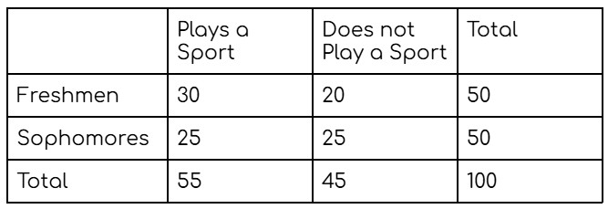

:::title

Tables & Surveys

:::

Tables and surveys can be used to organize data and collect information about a population.

On the SAT, you may need to interpret a table, calculate probabilities, or determine whether a sample represents a larger population.

:::mini-title

Two-Way Tables

:::

A **two-way table** organizes data according to two different categories.

The rows and columns represent different groups, while the values inside the table show how many individuals belong to each combination of categories.

A school surveys 100 students about whether they play a sport.

The totals at the ends of the rows and columns are called **marginal totals**.

For example, 55 students in the survey play a sport.

:::example

Using the table above, what is the probability that a randomly selected student plays a sport?

P(plays a sport) = 55⁄100

P(plays a sport) = 0.55

:::

When finding a conditional probability, the total you use depends on the condition given in the question.

:::example

Using the table above, what is the probability that a freshman plays a sport?

P(plays a sport | freshman) = 30⁄50

P(plays a sport | freshman) = 0.6

:::

:::tip

Pay attention to the group named in the question. That group is usually the denominator for a conditional probability.

:::

:::mini-title

Sampling

:::

A **population** is the entire group being studied. A **sample** is a smaller group selected from the population.

A **random sample** gives members of the population a fair chance of being selected.

:::example

A school has 1,000 students and wants to know how many students support a new school policy.

The school randomly selects 100 students and surveys them.

The 1,000 students are the population, and the 100 students are the sample.

:::

A sample should be representative of the population if you want to use the results to make conclusions about the entire population.

:::example

A city wants to know how residents feel about a new park. It randomly selects residents from different neighborhoods to complete a survey.

:::

This is more representative than surveying only people who live next to the park.

:::mini-title

Bias

:::

**Bias** occurs when a method of collecting data systematically favors certain results or groups.

A sample can be biased if some members of the population are more likely to be selected than others.

:::example

A school asks students leaving the basketball game whether they support adding more sports facilities.

:::

This sample may be biased because students who attend basketball games may be more likely to support additional sports facilities.

A survey can also be biased if the wording of a question influences how people respond.

:::example

"Don't you agree that the school should provide more study areas?"

:::

This question is leading because it encourages a particular response.

:::tip

When evaluating a survey, ask whether the sample represents the entire population and whether the wording of the questions could influence responses.

:::

:::mini-title

Data Interpretation

:::

The SAT may give you a table or survey and ask you to interpret the data.

Read the labels carefully and identify what each row, column, and value represents before calculating.

:::example

A survey asks 200 students whether they prefer studying at home or at school.

| | Home | School | Total |
|---|---:|---:|---:|
| Freshmen | 60 | 40 | 100 |
| Sophomores | 50 | 50 | 100 |
| Total | 110 | 90 | 200 |

:::

The percentage of students who prefer studying at home is:

110⁄200 = 55%

:::example

Using the same table, what percentage of sophomores prefer studying at school?

50⁄100 = 50%

:::

The table can also be used to compare groups.

For example, 60% of freshmen prefer studying at home, while 50% of sophomores prefer studying at home.

:::tip

Before calculating, identify exactly which group the question is asking about. The correct denominator depends on the group being measured.

:::

